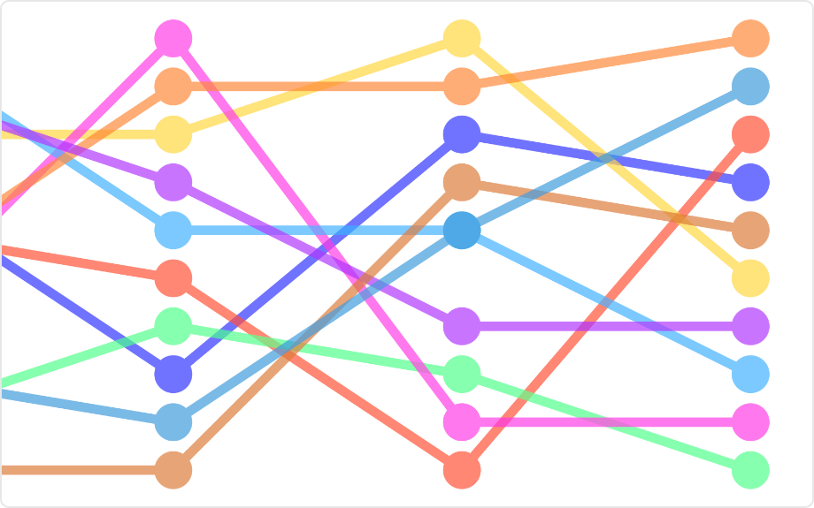

# Bump Chart Mod for Spotfire®

A special type of line chart designed for exploring changes in ranking over time. Useful to compare the position / performance / ranking of multiple observations rather than the actual values itself.

## Installation & Use

[Download latest version](https://github.com/spotfiresoftware/spotfire-mod-bump/releases)

The [Wiki](https://github.com/spotfiresoftware/spotfire-mod-bump/wiki) contains step-by-step instruction on how to install and use this Mod in Spotfire®.

## Building the Project

In a terminal window:
- `npm install`
- `npm run build-watch`

In a new terminal window:
- `npm run server`

### Building for production

The development version of bundle.js is uncompressed and not suitable for end-users. Run the following command to compress the bundle:
- `npm run build`

## About Mods for Spotfire®
-   [TIBCO Community Exchange](https://community.tibco.com/s/global-search/%40uri#q=mod%20for%20tibco%20spotfire&t=Exchange&sort=date%20descending): A safe and trusted place to discover ready-to-use mods
-   [Developer documentation](https://tibcosoftware.github.io/spotfire-mods/docs/): Introduction and tutorials for mods developers
-   [Mods examples](https://github.com/TIBCOSoftware/spotfire-mods/releases/latest): A public repository for examples projects
